# Adopting Legacy Systems

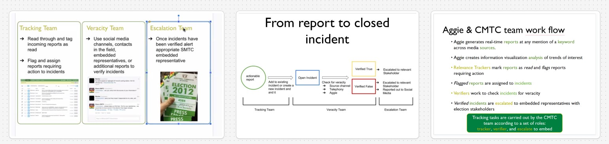

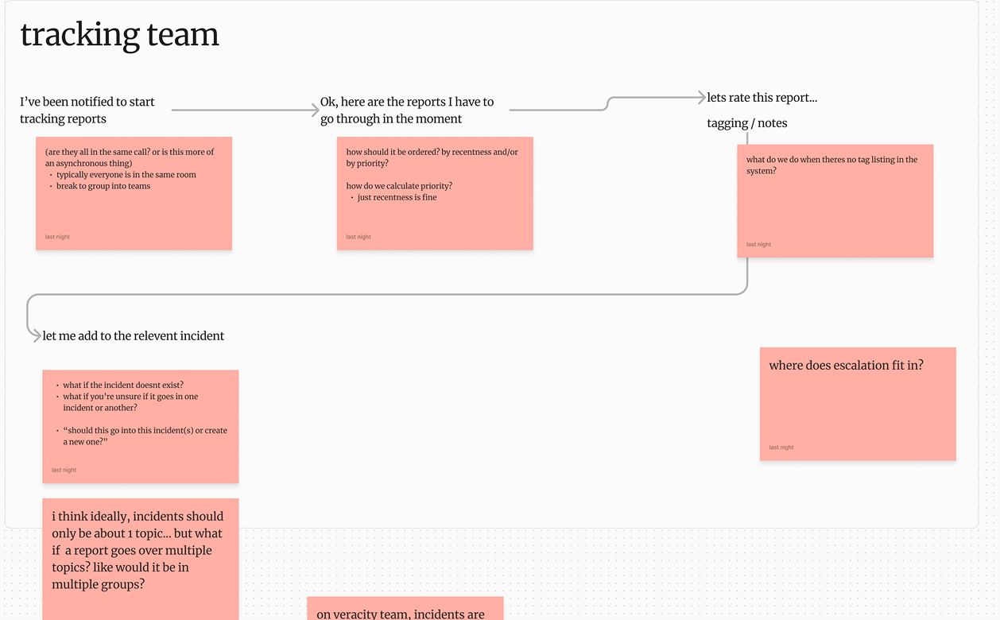
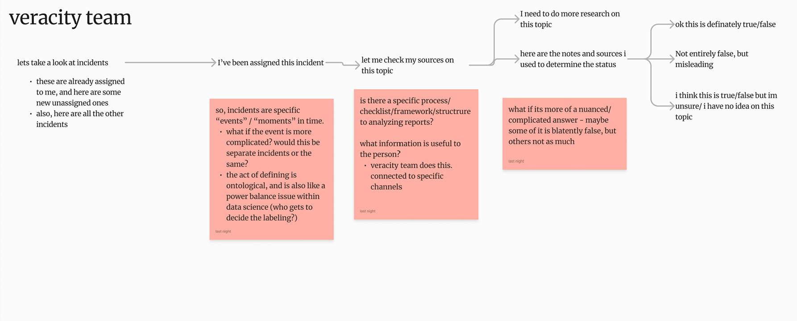
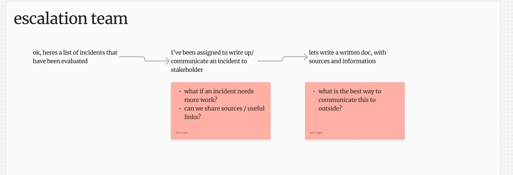

# Qualitative User Feedback

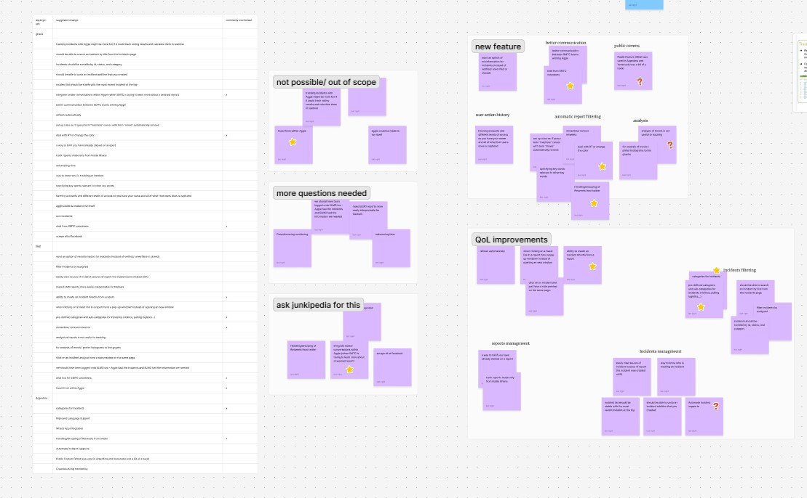
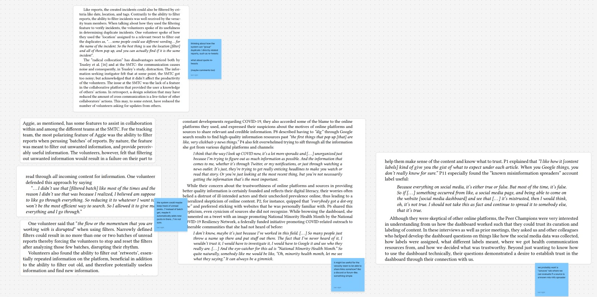

How can we better facilitate real-time communication between volunteers?

Legacy systems carry over limitations that can't be easily engineered away. How can we work around these through design?

People often doubt that the technology works, leading to doublechecking work that is already done. Instead of saving time, the technology has instead made it harder for the volunteers. How can we improve perceived trust in the tech system?

# Multiplayer & Realtime UX

What makes multiplayer unique is that other people are interacting and changing the same interface per-second, meaning the interface must react accordingly, if not, there is a high-risk of conflict, where two users edit the same thing resulting in a mis-alignment between the user expectation and actual output.

## Conflict Management Framework

**Prevention**: Design systems that discourage moments of conflict that can occur. In this instance, 10s of users interacting with the same interface should work just fine.

**Resolution**: We must expect some things to slip through and cause conflicts. It should be simple for users to undo, change, and fix these conflicts

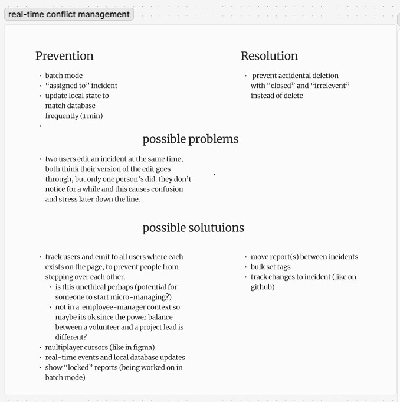

# Wireframes

## Reports

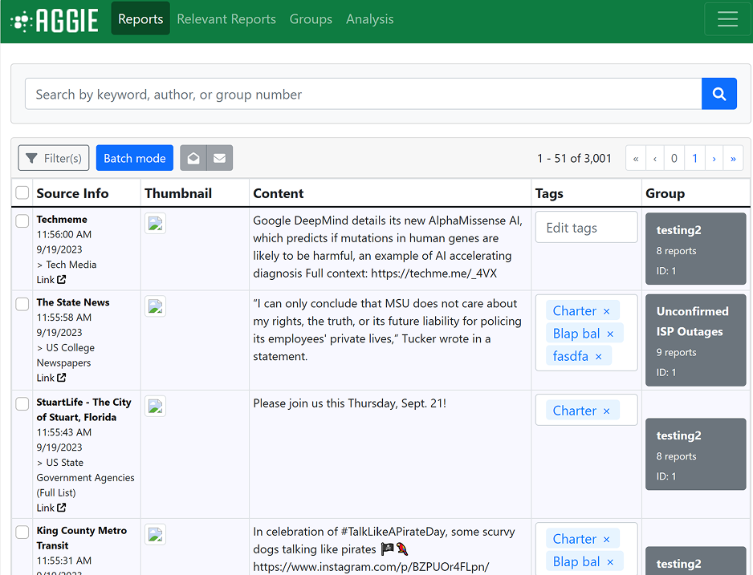
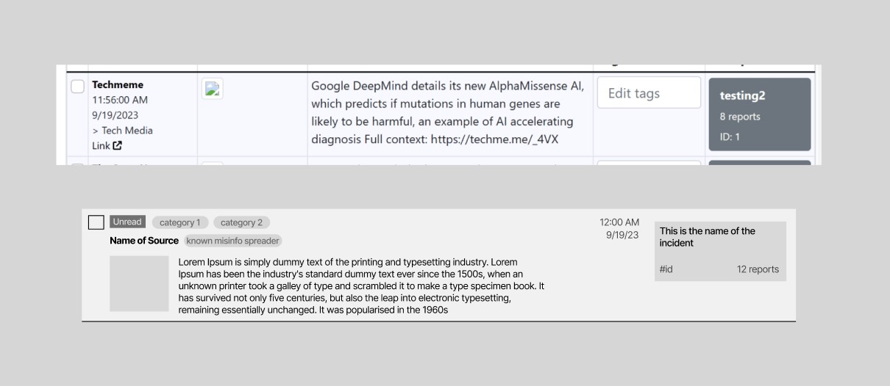
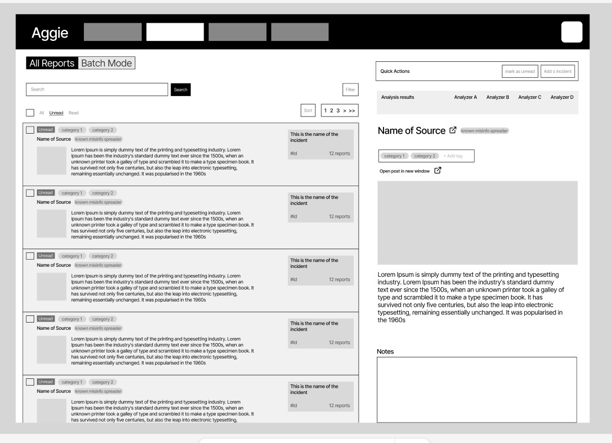

## Incidents

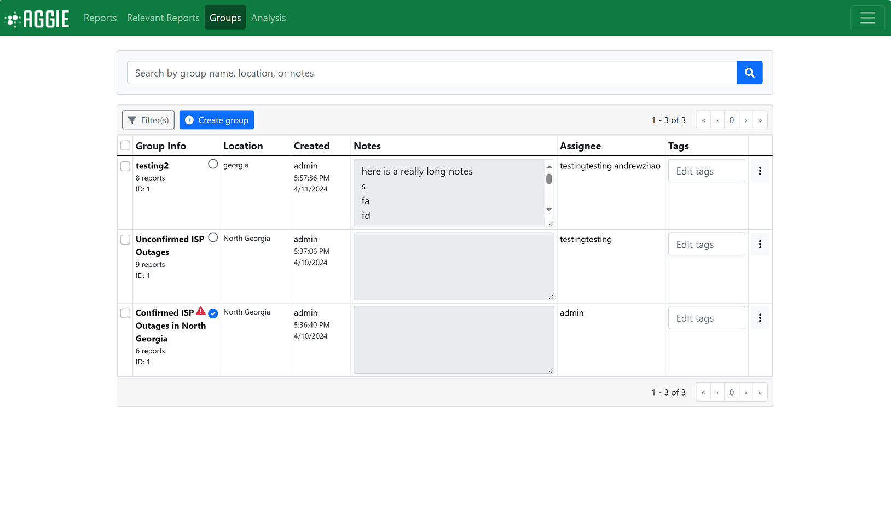
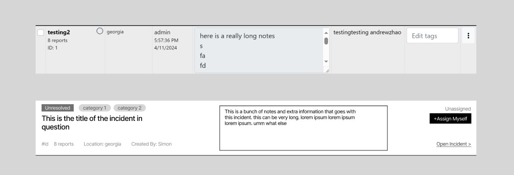
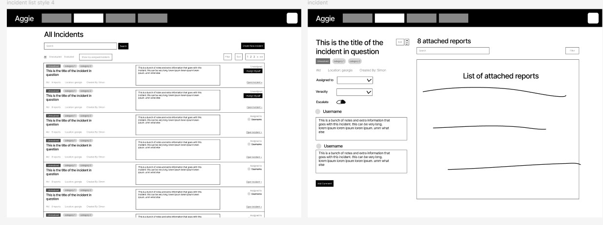

# Demo

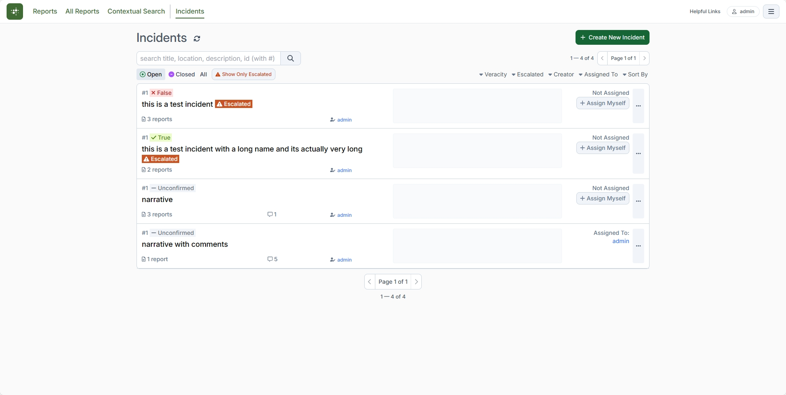
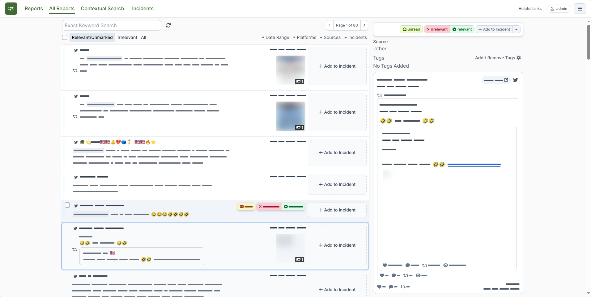
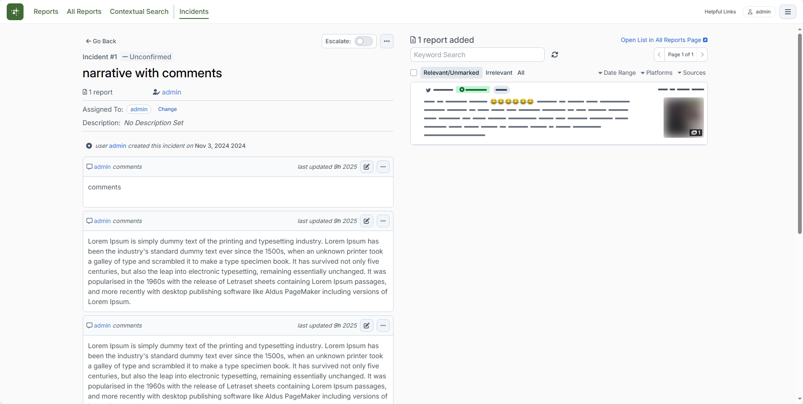
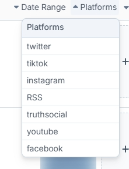
