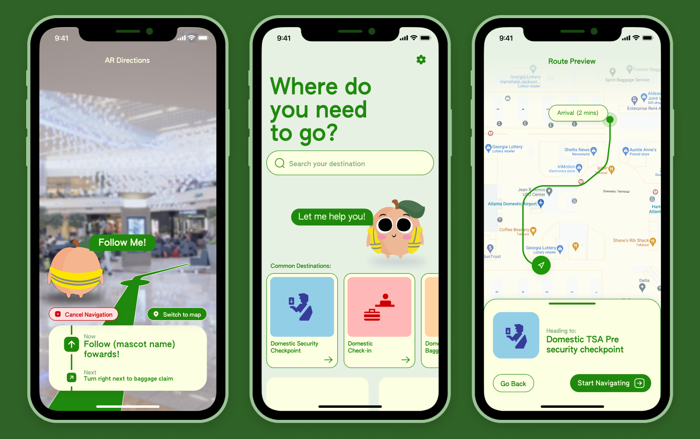

Client: Hartsfield-Jackson Atlanta International Airport
Context of Study: Wayfinding/ Travelers, Guests & Customers for ATL

## The Problem

The Atlanta's domestic airport built four new "Skywalks" from the north and south parking decks into the domestic terminal to alleviate congestion issues caused by people crossing the drop-off lanes. However, people were still using the crosswalks below when investigated. The CX team from the Airport asked us to investigate why. Our team was tasked with the wayfinding of the "locationally challenged"(those who are lost easily) user group.

# Desk Research and Framing

To start, our team started by conducting desk research to become familiar with the space.

eventually, we arrived at the psychology and science behind people who get lost easily. (This is a whole field of study!) The paper [Cognitive Maps: Some People Make Them, Some People Struggle](https://journals.sagepub.com/doi/full/10.1177/0963721417744521) by Weisberg et. al. describes three groups of people: integrators, nonintegrators, and imprecise navigators.

We were able to use this to frame our problem space and approach in our ethnographic study.

# Ethnographic Study

# Synthesis and Analysis

# Potential Solutions

# Reflection

This project taught me a lot about user ethnography, the nitty-gritty of actually obtaining valuable research information. Just as important, this project taught me the importance of questioning the prompt itself, as often the reason why the client struggles is because of a focus on the wrong problem. In this case, the problem is not the bridges themselves but everything surrounding it. This project revealed the complexity of working with clients, who each have situations (budgets, office politics, etc) that constrain the design problem/space.

I wish we pushed the client to think outside the prompt. The problem wasn’t simply people magically unable to find the skybridge, but rather that the entire infrastructure of the building makes the skybridges difficult to access and uninviting. It is clear that a large part of the failure of the skybridges comes from the design of the parking lot and the drop off lanes. We knew that the problem was the lack of access to the fourth floor, so we should have been more aggressive in our solutions.

I will note that there may have been cultural or other external factors at play that we did not consider, but that was out of the scope of this project. This would be interesting to investigate further.
