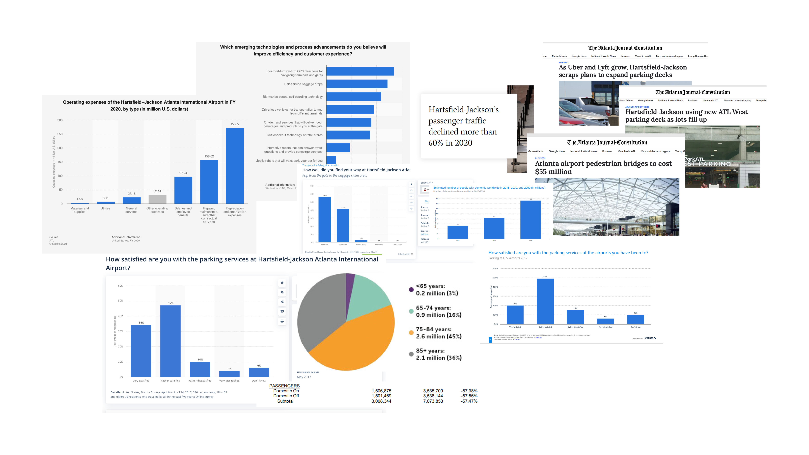

## ATL's new bridges hasn't helped with congestion issues in the domestic terminal parking. <mark>Why don’t people actively utilize the new skybridges?</mark>

The Atlanta's domestic airport built four new "Skywalks" from the north and south parking decks into the domestic terminal to alleviate congestion issues caused by people crossing the drop-off lanes. However, people were still using the crosswalks below when investigated. The CX team from the Airport asked us to investigate why.

## Our team was tasked with the <mark>wayfinding of the "locationally challenged"</mark> (those who are lost easily) user group.

# Desk Research and Framing

<mark>Between-route learning:</mark> Involves making inferences about how landmarks
on two routes are related to each other. Mental-map style of navigation.

<mark>Within-route learning:</mark> Involves memory of landmarks along familiar routes.
Route-landmark style of navigation.

## Studies suggests two mental models for navigation: <mark>Within-Route</mark> and <mark>Between-Route</mark> Learning.

To start, our team started by conducting desk research to become familiar with the space. The paper [Cognitive Maps: Some People Make Them, Some People Struggle](https://journals.sagepub.com/doi/full/10.1177/0963721417744521) by Weisberg et. al. describes how people learn and the types of people that stuggle with navigation.

## Three groups of users when it comes to navigation: <mark>integrators,</mark> <mark>non-integrators,</mark> and <mark>imprecise navigators.</mark>

We were able to use this to frame our problem space.

# Ethnographic Study

## We we able to gather both qualitative and quantitative data through three ways: <mark>observation,</mark> <mark>stop-and-ask,</mark> and <mark>formal interviews.</mark>

Our team took the trip onsite multiple times to conduct the study.

## We realized that <mark>most people didn't travel between floors,</mark> and that people rarely come from the 4th floor parking deck in general.

We observed the foot traffic coming in and out from the parking deck onto the skywalks, a collective ~20hrs of observing. This gave us quantitative data on where people were going

> ### We gathered 20 stop-and-ask and 3 formal interviews.

## In an <mark>ideal world,</mark> the journey to use the crosswalks should be simple...

## However, even just traveling between these two short locations, there are many decisions required, leading users down <mark>unhappy paths</mark>

## Our Team was able to turn organize interviews and determine that those who get lost easily have a have more <mark>essential needs</mark> compared to other travelers.

# Insights

## Non-integrators rely more on their <mark>sense of spatial orientation</mark>, in addition to their sense of sight.

In contrast to integrators (who are not directionally challenged), non-integrators rely on their understanding of their position in relation to the surrounding space.

<mark>Shadow Observation:</mark> 👀 Confused users walked towards an opening.

<mark>Interviewee:</mark> 💬 "I would honestly just pick a random path and see if
it clears up to like another building or an exit… just to find like an opening"

## Imprecise navigators struggle with both mind-map and route-landmark navigation, therefore they <mark>rely more on verbal signage</mark> over other indicators.

Too much signage however can confuse users, as they are more likely to overthink compared to others and are less able to infer from observations.

<mark>Stop-and-Ask:</mark> 💬 "I just follow signs"

<mark>Interviewee:</mark> 💬 "I'll probably look for signs"

## For those who get lost easily, <mark>their need for safety must be met</mark> before they worry about efficiency and esteem needs.

In contrast to integrators (who are not directionally challenged), non-integrators rely on their understanding of their position in relation to the surrounding space.

<mark>Interviewee:</mark> 💬 “The thing is I'm not really looking for the most efficient
path. I'm just looking for a path to get to where I need to go.”

<mark>Interviewee:</mark> 💬 “But that's when it's hard is cause I'll go so many
ways in order to find that and then finally go to that sidewalk that goes to the
entrance of the airport."

# Potential Solutions

## Design Strategy: Simplify the decision-making process by <mark>minimizing the number of navigational decisions</mark> a traveler needs to make.

## <mark>Removing contradicting signs</mark> will reduce confusion among non-integrators and imprecise navigators.

Currently, the signs on the 4th floor point to different paths to Terminal, some pointing downstairs while others to the skybridge.

## Update infrastructure to <mark>visually and spatially que users</mark>

The infrastructure of the parking lot should invite people and lead people into the bridge itself, unlike the current, closed off variation. We can use standard visual ques like painted lines, arrowed signs, etc. Additionally, adding large structures like escalators further ques users into the right spaces.

## Cohesive, Descriptive, Eye-Level Signage

freestanding digital E-ink powered displays not only is eye-level, but also flexible and isn't restricted by the architecture of the building.

mascot drawn by Rebekah Ressler

## AR Digital Experience to guide users to their destination

More accessible as users, welcoming interface & mascot soothes stressed travelers

# Reflection

This project taught me a lot about user ethnography, the nitty-gritty of actually obtaining valuable research information. Just as important, this project taught me the importance of questioning the prompt itself, as often the reason why the client struggles is because of a focus on the wrong problem. In this case, the problem is not the bridges themselves but everything surrounding it. This project revealed the complexity of working with clients, who each have situations (budgets, office politics, etc) that constrain the design problem/space.

I wish we pushed the client to think outside the prompt. The problem wasn’t simply people magically unable to find the skybridge, but rather that the entire infrastructure of the building makes the skybridges difficult to access and uninviting. It is clear that a large part of the failure of the skybridges comes from the design of the parking lot and the drop off lanes. We knew that the problem was the lack of access to the fourth floor, so we should have been more aggressive in our solutions.

I will note that there may have been cultural or other external factors at play that we did not consider, but that was out of the scope of this project. This would be interesting to investigate further.
